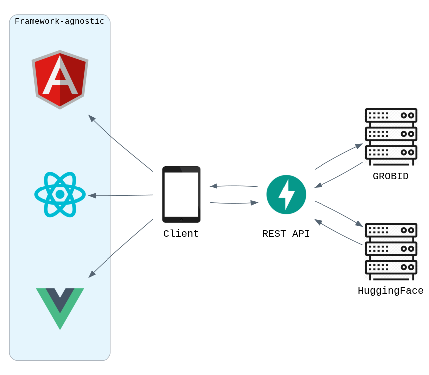

# Architecture

The project is a monorepo following the client-server model. The project is
split into frontend (client) and backend (server).

## Docker

Docker is used to strictly for development at the moment. The images will start
servers with development configuration. If you wish to change this behaviour, change the
`docker-entrypoint.sh` file or the `CMD` in the Dockerfile.

By default, the backend uses port 8000 and the frontend uses port 3000.

## Frontend

We use Javascript and Typescript interchangably since the build system we use, Vite, supports both.

The current packages are:

- `models`: Custom interfaces we use for Typescript validation. Typescript only.
- `modules`: ES6 modules using the [module design pattern](https://www.patterns.dev/posts/module-pattern/). Javascript or Typescript.
- `styles`: Stylesheets for the views. SCSS or CSS. SCSS is prefered since it supports nesting, which is useful for encapsulation.
- `views`: Views inherit the AbstractView class and are injected into the
  `#outlet` div. In order to switch views, we use the [Navaid](https://github.com/lukeed/navaid) library to switch routes. Typescript or Javascript.

[Frontend API documentation](https://ram02.gitlab.io/team20-project-frontend/)

### Storage

We currently do not use either `SessionStorage` or `LocalStorage`, however, we
can use them to store application data, like theme preference.

## Backend

The current packages are:

- [`api`](https://ram02.gitlab.io/team20-project-backend/app.api.html): Defines the routes and response models of the API. 
Written using [FastAPI](https://fastapi.tiangolo.com/).
  For the development server, we use [uvicorn](https://www.uvicorn.org/) and for the production server we use [gunicorn](https://gunicorn.org/).
- [`grobid`](https://ram02.gitlab.io/team20-project-backend/app.grobid.html): Contains the GROBID API client and TEI XML parser which follows the [GROBID annototation guidelines](https://grobid.readthedocs.io/en/latest/training/General-principles/) and the Python data classes that represent GROBID elements.
- [`nlp`](https://ram02.gitlab.io/team20-project-backend/app.nlp.html): Implements various classes using NLP techniques like phrase extraction and abstractive summarisation.

[Backend API documentation](https://ram02.gitlab.io/team20-project-backend/)

### Storage

We currently do not store any data on the backend. However, we use the `Document`
class powered by [PyMuPDF](https://github.com/pymupdf/PyMuPDF) to heuristically
extract the DOI of a given document. The DOI could then be used as a key for an
in-memory cache storage system like Redis or Memcached, since it is unique to
every scholarly article.

### External APIs

The backend makes use of external APIs in order to satisfy its own routes.

#### GROBID

GROBID is a machine learning library for extracting, parsing and restructuring scholarly PDF articles in to structured TEI XML documents.

We currently only use the [processFullTextDocument](https://grobid.readthedocs.io/en/latest/Grobid-service/#apiprocessfulltextdocument) API endpoint.

[Annotation guidelines](https://grobid.readthedocs.io/en/latest/training/fulltext/)

Our `docker-compose` configuration automatically starts the GROBID service
locally. The API is accessible on port 8070.

#### HuggingFace

[HuggingFace](https://huggingface.co/inference-api) is a hub of ML models. We currently use its inference API to use
their [BART](https://arxiv.org/abs/1910.13461) summarization pipeline.

By default, the `/upload` API route does not use the inference API unless you
add a HuggingFace API key to the backend's `.env`.

We are using their [`transformers`](https://huggingface.co/docs/transformers/index) library locally for tokenization, but
since the text generatation models like BART require a ML framework like `PyTorch` or `Tensorflow` which need CUDA GPUs for effecient timings.
